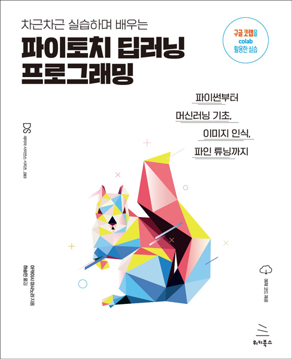
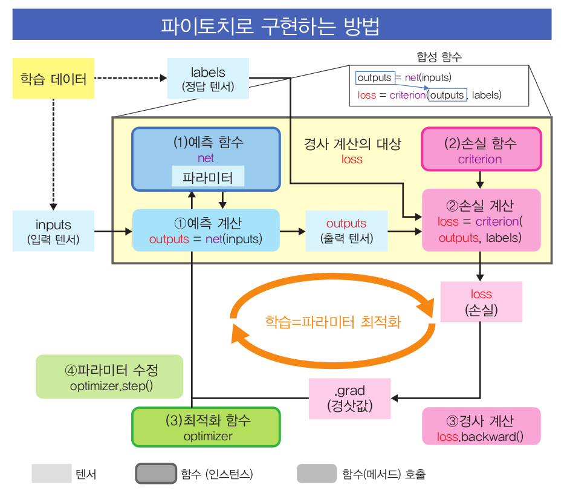
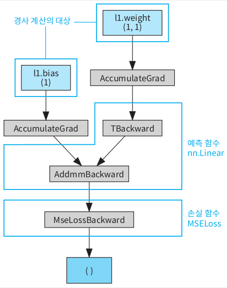

# 차근차근 실습하며 배우는 파이토치 딥러닝 프로그래밍

이 페이지는 《차근차근 실습하며 배우는 파이토치 딥러닝 프로그래밍》의 저장소입니다.  

## 실습 Notebook 링크
이 책의 모든 실습 코드는 Google Colab 에서 동작을 전제로 하며 Github(본 저장소)에 공개되어 있습니다.

[실습 노트북 목록](notebooks.md)

[실습 노트북 실행 방법](refs/how-to-run.md)

## 내용소개
AI 프레임워크로 유명한 파이토치(PyTorch)를 활용해 딥러닝 프로그램을 작성하는 방법을 다룬 책입니다. 딥러닝 알고리즘을 원리부터 터득할 수 있고, 초보자도 이 책 한권이면 딥러닝을 쉽게 배울 수 있습니다!

이 책은 다음과 같은 독자를 상정합니다.

1. **기업에서 딥러닝 프로그램을 실무에 사용하고 있거나 이제부터 딥러닝을 사용하려는 IT 엔지니어 및 연구자**  
　케라스/텐서플로를 사용해본 경험이 있는 독자에게는, 파이토치만의 독특한 ‘정책’이 걸림돌이 될 수 있습니다. 특히 파이토치는 ‘다중 분류 모델에서 사용하는 손실 함수’에 관한 개념이 독특하며, 이 점을 본문에서 최대한 알기 쉽게 설명하고 있습니다.

2. **입문서를 읽고 머신러닝이나 딥러닝의 구현에 관한 이미지는 가지고 있으나, 앞으로 어떻게 활용해 나갈지 모르는 분**  
　9~12장의 ‘이미지 인식 실전편’에서는 비교적 적은 양의 데이터로 학습을 가능케 하는 ‘전이학습’을 활용해, 자신이 직접 수집한 이미지 데이터로 분류 모델을 만드는 방법에 관해 설명합니다. 12장까지 공부하면, 자신이 모은 이미지 데이터로 직접 분류 모델을 만들어 볼 수 있습니다. 그리고, 8장까지는 파이토치로 프로그램을 작성하는 방법을 이해함과 동시에, 지금까지 여러 입문서에서 배운 머신러닝, 딥러닝 알고리즘을 복습하기 위한 내용으로 구성되어 있습니다.

3. **연구를 위해 딥러닝 프로그램을 개발해야 하는 이공계 학부생 및 대학원생**
 앞으로 논문을 통해 공개된 구현 코드를 테스트해보기 위해서는 파이토치에 관한 지식이 필수입니다. 이 책은 딥러닝에 필요한 수학도 함께 설명하므로 공개 코드를 정확하게 이해하고 응용할 수 있습니다.

4. **아직 파이썬이나 케라스/텐서플로를 모르지만, 딥러닝 프로그래밍을 이제부터 공부하고 싶은 분**  
 초심자를 위해 파이토치 프로그램을 이해하는데 필요한 파이썬의 기본 문법과 넘파이(NumPy), 매트플롯립(Matplotlib)에서 알아야 할 최소한의 기능을 이 책의 말미에 부록으로 준비했습니다. 딥러닝이 목적이라면 이 책의 부록에 기술된 개념과 기능만 이해하면 충분하므로, 딥러닝을 배우기 위한 출발선으로 생각하면 좋을것입니다.
 
 이 책은 새로운 개념을 한번에 다루기 보다는 최대한 세분화해서 한걸음씩 확실하게 이해해 나가도록 구성되어 있어, 머신러닝의 기본부터 CNN을 사용한 이미지 인식 딥러닝 모델의 개발·튜닝까지 자세하게 배울 수 있습니다.

## 목차

* 미리보기    이미지 인식 시작하기

### 기초편  
* 1장     딥러닝에 꼭 필요한 파이썬의 개념
* 2장     파이토치의 기본 기능
* 3장     처음 시작하는 머신러닝
* 4장     예측 함수 정의하기

### 머신러닝 실전편 
* 5장     선형 회귀
* 6장     이진 분류
* 7장     다중 분류
* 8장     MNIST를 활용한 숫자 인식

### 이미지 인식 실전편 
* 9장     CNN을 활용한 이미지 인식
* 10장    튜닝 기법
* 11장    사전 학습 모델 활용하기
* 12장    사용자 정의 데이터를 활용한 이미지 분류

### 부록
* 파이썬 입문
* 넘파이 입문
* 매트플롯립 입문

## 이 책의 특징

### 경사 하강법의 동작원리와 파이토치의 구현을 그림으로부터 이해!
 딥러닝의 학습 원리인 경사 하강법에 관해, 이 책의 3장에서 산에 오르는 과정에 비유해 복잡한 수식 없이 이해할 수 있도록 설명하고 있습니다. 알고리즘의 동작원리와 파이토치의 구현을 구체적으로 이해하기 위해 아래 2개의 그림을 수록했습니다.

**경사 하강법의 동작 원리**

  

**파이토치로 경사 하강법을 구현**

### 중요한 개념을 한걸음씩 이해!
파이토치 프로그래밍에서 중요하게 여기는 개념들은, 차근차근 확실하게 이해해 나갈 수 있도록 다루고 있습니다. 아래의 코스맵을 통해, 어떤 개념까지 배웠는지 한눈에 확인할 수 있습니다.

**코스 맵**

### 합성 함수도 시각화 툴을 통해 이해!
머신러닝·딥러닝에서 학습이란, ‘손실’로 불리는 합성 함수를 최적화해 나가는 과정입니다. 이 책에서는 파이토치가 자동으로 생성한 합성 함수(계산 그래프)를 시각화하는 툴을 활용해서, 합성 함수의 형태를 그림을 통해 이해할 수 있도록 했습니다.

**계산 그래프의 시각화 예시**

## 기타 해설

* [ONNX 파일로 추출하는 방법](refs/onnx.md)  
11장의 칼럼 ‘**범용적인 사전 학습 모델을 작성하는 법**’에서 언급한 순서는 이 링크를 참조하기 바랍니다.

## 정오표·FAQ

* 정오표는 위키북스 홈페이지의 [책 소개 페이지](https://wikibook.co.kr/pytorchdl2/)를 참조.

* [자주 묻는 질문(FAQ)](refs/faqs.md)

