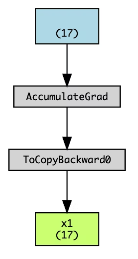
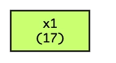

# 2.4절 p.80 각주 보충

(원문: https://qiita.com/makaishi2/items/2c40fe43c01b35acb8c4#24節-p80脚注の補足)

이 각주는 설명이 불충분한 곳이 있으므로, 코드나 그림으로 보충 설명을 합니다.

해당 부분의 설명 준비로서 우선 아래의 코드가 실행이 끝난 것을 전제로 합니다.

```
# 필요한 라이브러리 가져 오기
import numpy as np
import torch
from torchviz import make_dot

# x를 numpy 배열로 정의
x_np = np.arange(-2, 2.1, 0.25)
```

여기서 1계 텐서 x1을 통상의 float 함수에 의한 방법으로 정의해 보겠습니다. 구현 코드는 아래와 같습니다.

```
# 1계 텐서 배열 선언
# float 함수를 사용하여 float 지정
x1 = torch.tensor(x_np, requires_grad=True).float()
```

이 형태로 선언한 x1은 이 단계에서 이미 계산 그래프의 리프가 될 수 없습니다. make_dot 함수로 살펴보면 알 수 있습니다.

```
# 시각화 함수 호출
g= make_dot(x1, params={'x1': x1})
display(g)
```

시각화 결과는 다음과 같습니다.



x1이라는 변수는 원래 변수에 대해 ToCopy라는 작업을 수행한 결과, 즉 리프 노드가 아니라는 것입니다. 그래서 이렇게 만들어서 x1에 대해 그라디언트 계산을 할 수는 없습니다.  
그런 다음 책의 코드에서 같은 것을 시도해 보겠습니다.

```
# 1계 텐서 배열 선언
# dtype을 사용하여 float 지정
x1 = torch.tensor(x_np, requires_grad=True, 
    dtype=torch.float32)

# 시각화 함수 호출
g= make_dot(x1, params={'x1': x1})
display(g)
```

이번에는 이런 결과가 되었습니다.



이것은 이렇게 만든 변수 x1이 리프 노드로 남아 있다는 것을 의미합니다.
