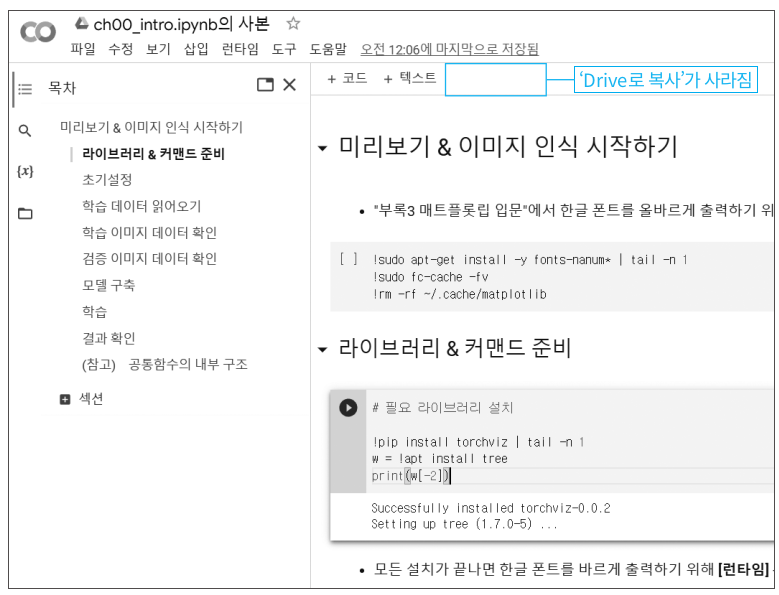

## 실습 Notebook을 사용하는 방법

**전제**  
Gmail 계정이 사전에 등록되어 있고, 별도의 탭에서 Gmail에 로그인한 상태를 전제로 합니다.

1. 아래의 링크를 클릭해서 Notebook 목록을 표시합니다.  
   (ctrl 키를 누른 상태로 클릭하면 별도의 탭으로 표시됩니다.)   
[Notebook 목록](../notebooks.md)
<!---
[Notebook 목록](../notebooks.md){:target="_blank" rel="noopener"} 

<a href="../notebooks.md" target="_blank">Notebook一覧</a>

-->  

2. 실행하고 싶은 Notebook의 링크를 클릭합니다.  
   (아래는 첫번째의「미리보기」링크를 클릭한 경우의 화면입니다.)

3. 파란색 사각형으로 표시된「Drive로 복사」를 클릭합니다.

4. 위의 화면처럼 보인다면, notebook 실행 준비가 완료된 것입니다.

　화면 상단의「# 필요 라이브러리 설치」의 아랫부분을 마우스로 클릭하면, 위의 그림과 같이 좌측 상단의 파란색 원으로 표시된 화살표 모양의 아이콘이 표시됩니다.  
　Notebook에는「셀」이라는 상자 단위로 프로그램을 실행할 수 있습니다. 화살표 아이콘은 현재 선택된「셀」을 의미합니다.  
　이 상태로「Shift + Enter」(Shift를 누른 상태로 Enter를 누름)을 입력하면, 선택중인 셀이 실행됩니다. 프로그램의 실행에 다소 시간이 걸리지만, 최종적으로 아래 그림과 같은 상태로 됩니다.

　이하,「Shift + Enter」로 셀을 실행해주기 바랍니다.

[메인 페이지로 돌아가기](../README.md)
