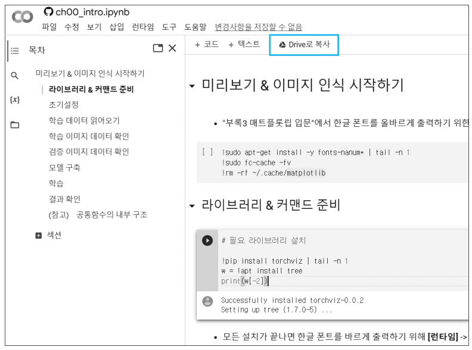
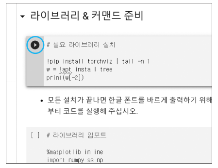

## 실습 Notebook 이동 방법

**전제**  
Gmail 주소를 미리 가져와 다른 탭에서 Gmail에 로그인한 상태로 둡니다.

1. 다음 링크를 클릭하여 노트북 목록을 표시합니다.  
(<kbd>Ctrl</kbd> 키를 누른 상태에서 링크를 클릭하면 다른 탭에서 열 수 있습니다.)   
[노트북 목록](../notebooks.md)

2. 실행할 Notebook 링크를 클릭합니다.  
(이하는 맨 위의 미리보기 ‘이미지 인식 시작하기’의 링크를 클릭했을 때의 화면입니다)

3. 파란색 테두리로 둘러싸인 ‘Drive로 복사’ 링크를 클릭합니다.

4. 위의 화면과 같이 되면, Notebook 실행 준비가 완료됩니다.

　화면 상단의 ‘라이브러리 & 커맨드 준비’의 아래를 마우스로 클릭합니다. 위 그림 왼쪽의 파란색 원으로 둘러싸인 화살표 아이콘이 표시됩니다.  
　Notebook은 ‘셀’이라는 상자 단위로 프로그램을 실행합니다. 화살표 아이콘은 현재 선택된 셀을 의미합니다.  
　이 상태에서 <kbd>Shift</kbd> + <kbd>Enter</kbd>를 입력하면 선택한 셀이 실행됩니다. 프로그램을 실행하는 데 약간의 시간이 걸리지만 결국 아래 그림과 같이 보일 것입니다.

　아래와 같이 <kbd>Shift</kbd> + <kbd>Enter</kbd>를 반복 실행합니다.

[메인 페이지로 돌아가기](../README.md)
